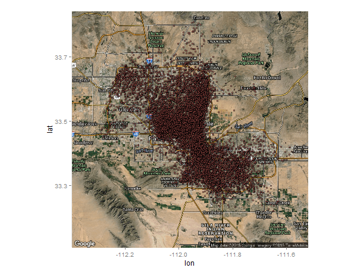

#title: Predicting Restaurants that will appeal to Local Consumers

#intro

Local consumers information has always had an important conotation both for people traveling to an area and for successful businesses. The popular phrase "when in Rome" refers to the idea that when travelling to a foreign land you can't go wrong if you do what the locals do. From a different standpoint, businesses generally consider it cheaper to retain a customer than to acquire a new one. Therefore the benefits of knowing the local market  will be an important factor towards driving repeat business. With these concepts in mind the questions that will be be addressed in this paper will be the following: 

- Can a population of local consumers be identified?
- Is there a pattern to the restaurants that local consumers prefer? 

Answering these questions are preliminary steps towards understanding a local marketplace and helping businesses identify opportunities for investment and avoid making changes that may lose their local customers.

#methods

A large portion of the population of reviews and tips come from the Phoenix area (Phoenix, Scottsdale, Tempe, Mesa, Gilbert and Glendale) as seen in the graph below. These bordering cities may not have as many reviews as Las Vegas, but together they are comparable and represent an area that has a more stable population than sin city.

#### Figure 1: Cities with the most reviews and tips

Using google maps it appeared that Arizona State Unizersity (ASU) is located in the middle of these selected cities. Using a 25 miles radius around ASU, the majority of the area of these cities are included in the area around ASU. 

The first step was isolating businesses and reviewers within this area. The businesses could be identified using the lattitudes and longitudes that were already provided. There were no locations provided for users and therefore assumptions had to be made to define and identify "local" users writing reviews withing the geographic area selected.

Local Users were defined by using the following assumptions:
- The centroid of the users reviews will be used as their current location
- The Users current location falls within a 25 mile radius of ASU's main campus
- The radius of 99% of the user's reviews are a short driving distance away by drive (15min away at 45mph)
- The user has reviewed or left a tip for at least 3 different businesses

#### Figure 2: Geographic distribbution of local users

The reviews from local users was used to identify local businesses were "Highly_Liked" within that group of local users. The following criteria were used to identify these businesses:
- An Avg rating in the 80 percentile of local user ratings (4.363636 stars)
- 10 or more ratings from local reviewers

A flag was created to to differentiate between "Highly_Liked" and non "Highly_Liked" businesses. The businesses in the population were then limited to restaurants based on the the category column. The other categories from the lists in that column were then extracted and flags were created to indicate which of these businesses were assigned that category. These flag fields were then merged with the times and attributes from the original business table to use for a random forest analysis. before running the analysis the following methods were used to limit columns run through the analysis:
- Remove columns with NA values that consist of >= 99% of the columns population
- Remove near Zero Variance fields
- 

#results

I was able to find a significant number of "local" users that only rate businesses within a fixed distance from their calculated location.

The results of the random forest were not very conclusive with the fields used.

####Confusion Matrix:

####Other Statistics:         
Accuracy : 0.801
Specificity : 0.5455           
Sensitivity : 0.8215 
'Positive' Class : N  

#discussion

The results show that the data can predict what restaurants will receive bad ratings fairlywell; however, the predictions for good ratings are not very helpful. In the future additional items could be considered such as geographical location. Also, my analysis used 53 variables for the random forest and with limited memory I also used limited trees which may have affected my results.

In the future I would like to see if I can create a better prediction model for 
