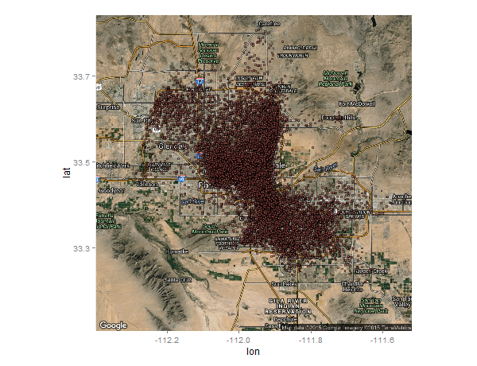

## Intro

This project aimed to look at whether the YELP data would yield anything valueable about local restaurants and how they are rated by local consumers that would potentially be repeat customers. This project will address the following:

- Can a population of local consumers be identified?
- Is there a pattern to the restaurants that local consumers prefer? 

Answering these questions are preliminary steps towards understanding a local marketplace and helping businesses identify opportunities for investment and avoid making changes that may lose their local customers.

## methods

Procedures:
(1) identify local areal
(2) identify local users
(3) assess reviews of local users on local businesses
(4) assess whether local users ratings are predictable

#### Figure 1: Reviews Geo Distribution

## results

I was able to find a significant number of "local" users that only rate businesses within a fixed distance from their calculated location.

The results of the random forest were not very conclusive with the fields used.

          
Confustion Matrix (Prediction / Reference)

   N  /  Y

N  451  / 20

Y   98  / 24

####Other Statistics:         
Accuracy : 0.801
Specificity : 0.5455           
Sensitivity : 0.8215 
'Positive' Class : N  

## discussion

The results show that the data can predict what restaurants will receive bad ratings fairlywell; however, the predictions for good ratings are not very helpful. In the future additional items could be considered such as geographical location. Also, my analysis used 53 variables for the random forest and with limited memory I also used limited trees which may have affected my results.

In the future I would like to see if I can create a better prediction model for this. Also it would be interesting to compare the ratings of people that stay local to those that travel farther and also to consider how those ratings from those that are local are significantly different from the overall rating of businesses.

